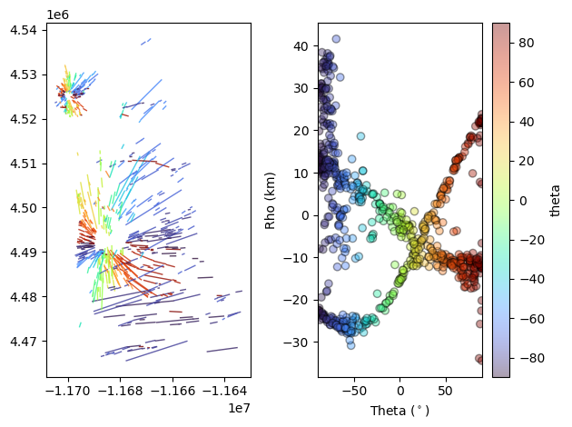
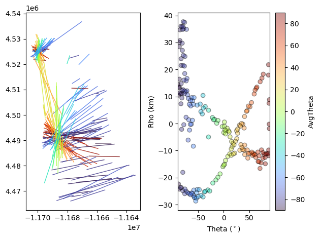
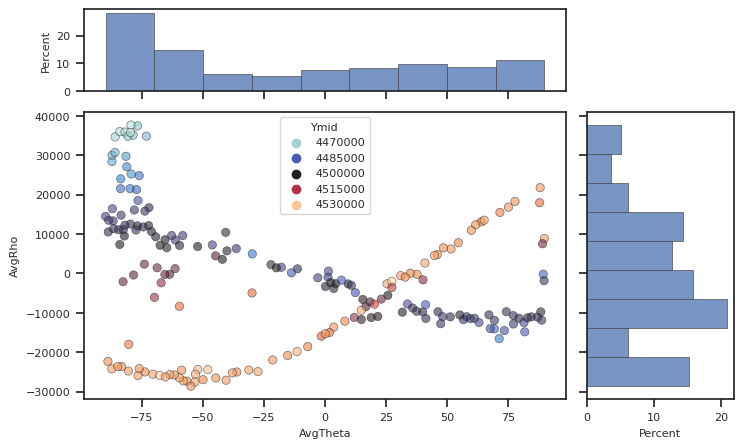
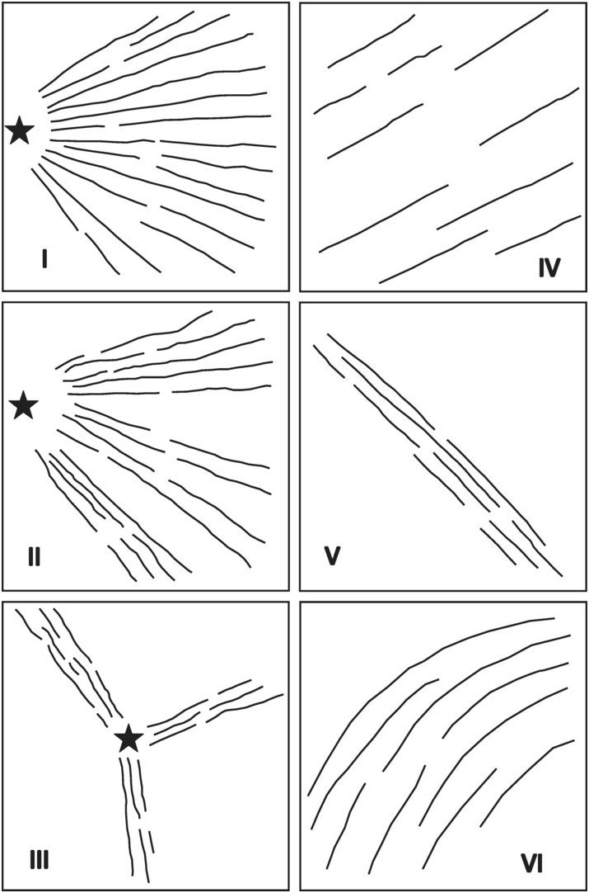
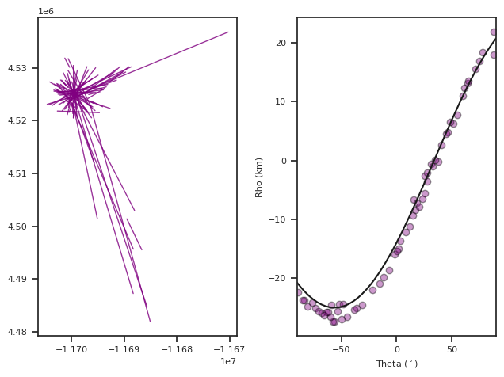
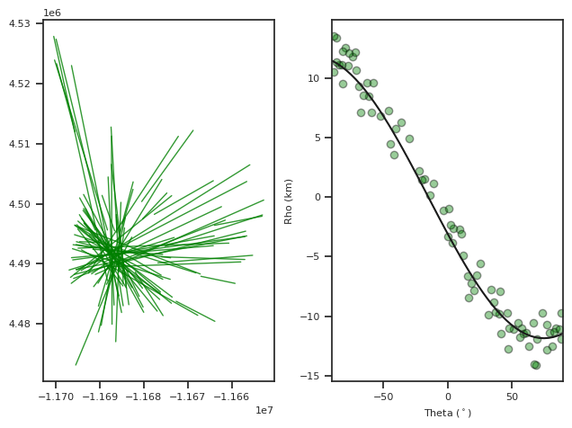

**Example Usage of LinkingLines Module**

The goal of this code is to link colinear line segments spread over
Cartesian space in the Hough Transform coordinates. It takes the
endpoint coordinates of line segments and performs clustering on them
and outputs the combined lines and analyctics on it. This code was used
to produce `Kubo Hutchison et al.,
2023 <https://agupubs.onlinelibrary.wiley.com/doi/10.1029/2022GC010842>`__

This example replicates the process of linking dike segments for the
Spanish Peaks Dike Swarm in Colorado, USA. Exposure bias, the uneven
mapping of dikes, has segmented the dikes so their true lengths can only
be estimated. This code links the far reaching segments based on
orientation. Later we will also show a post processing step where
different parts of the swarm can be extracted.

In this example we will go through many of the tools available in this
module. The process is:

1.  Load in a CSV file with
    `Well-Known-Text <https://en.wikipedia.org/wiki/Well-known_text_representation_of_geometry>`__
    format
2.  Create a `pandas <https://pandas.pydata.org/>`__ DataFrame of the
    data
3.  Perform the `Hough
    Transform <https://en.wikipedia.org/wiki/Hough_transform>`__
4.  Visualize the Results
5.  Cluster based on Hough Space
6.  Make lines out of clusters
7.  Visualize and examine results
8.  Save data for QGIS operability
9.  Feature extraction
10. Save features

.. code:: ipython3

    #Let's begin by loading the modules 
    
    #previously published packages
    import pandas as pd 
    import matplotlib.pyplot as plt 
    import numpy as np 
    import scipy.cluster.hierarchy as sch
    import os
    import seaborn as sns
    from datetime import datetime
    import matplotlib.gridspec as gridspec
    
    
    
    import sys
    sys.path.append("../src")
    sys.path.append("/home/akh/myprojects/Dikes_Linking_Project/dikedata/spanish peaks")
    
    # Packages written for the paper
    from htMOD import HoughTransform
    from clusterMod import AggCluster
    from plotmod import DotsLines, plotScatterHist, pltRec, DotsHT
    from PrePostProcess import * 
    from examineMod import examineClusters, checkoutCluster
    from fitRadialCenters import RadialFit, NearCenters, CenterFunc

.. code:: ipython3

    # Load the example dataset 
    
    #load it using pandas.read_csv
    # the CSV must have a column called "WKT" and can have any other data 
    dikeset=pd.read_csv('/home/akh/myprojects/Dikes_Linking_Project/dikedata/spanish peaks/SpanishPeaks_3857.csv')
    
    #Preprocessing step
    dikeset=DikesetReProcess(dikeset)

The preprocssing step does several things necessary to run the
algorithm. First it converts the WKT strings into “Xstart” “Xend”
“Ystart” and “Yend” columns in the dataframe. It checks to make sure
there are no duplicate dikes in the database. Then it checks to make
sure each of the entries in the dataframe is a straight line.

The straight line checking is performed by fitting a line to all the
points in the WKT string and only accepting the entry if the fit of the
line is significant.

It also calculates several other useful metrics including segment length
and gives each segment a unique hash. The hash ID can be useful later to
check the uniqueness of your clusters.

The next step is to perform the Hough Transform

Besides the data the input in the hough transform code is the center
(xc,yc) which is assumed to be the mean of the X and Y coordinates. It
can be set arbitrarily. You may wish to set this to investigate
structures in your dataset. But most people will use the default
settings

It outputs theta, rho, xc, yc which then are added to the dataset as
columns.

.. code:: ipython3

    
    theta, rho, xc,  yc=HoughTransform(dikeset)
    print(xc,yc) 
    dikeset['theta']=theta #Add to the dataframe in a column called 'theta'
    dikeset['rho']=rho
    
    print(dikeset.columns)

.. parsed-literal::

    -11684130.47751338 4503174.613590027
    Index(['Unnamed: 0.2', 'Unnamed: 0', 'Unnamed: 0.1', 'Unnamed: 0.1.1',
           'Unnamed: 0.1.1.1', 'Unnamed: 0.1.1.1.1', 'Unnamed: 0.1.1.1.1.1',
           'Unnamed: 0.1.1.1.1.1.1', 'id', 'Formation', 'Xstart', 'Ystart', 'Xend',
           'Yend', 'seg_length', 'rho', 'theta', 'HashID', 'Xmid', 'Ymid', 'yc',
           'xc', 'PerpOffsetDist', 'PerpIntX', 'PerpIntY', 'Date_Changed',
           'ScaledRho', 'Labels'],
          dtype='object')

The module includes custom code to visualize the cartesian and hough
transform spacce next to eachother which is a useful exercise when
learning about the hough transform.

‘DotsLines’ is a useful tool which creates a matplotlib figure with two
subplots with cartesian space on the left and hough space on the right.
The ‘ColorBy’ argument can be used to color the segments and data by any
of the data columns in the pandas dataframe.

*Try to color it by “seg_length”.*

.. code:: ipython3

    fig,ax=DotsLines(dikeset, ColorBy='theta')

.. parsed-literal::

    km scale label

.. parsed-literal::

    /home/akh/myprojects/Dikes_Linking_Project/Linking-and-Clustering-Dikes/scripts/../src/plotmod.py:1198: UserWarning: The figure layout has changed to tight
      plt.tight_layout()

We can now use the clustering portion of the code to link the scattered
line segments for data reduction or analysis.

We use agglomerative clustering to perform and advise people choose
“complete” linkage to avoid chainning which will not yield colinear
segments. Read more about `agglomerative clustering
here <https://en.wikipedia.org/wiki/Hierarchical_clustering>`__ and the
`implementation
here <https://docs.scipy.org/doc/scipy/reference/cluster.hierarchy.html>`__.

The algorithm takes the data as input and it takes two scaling factors
dtheta, and drho. These two scaling factors are used to set the maximum
distances over which two segments will be clustered. The maximum
distance,d, is set to one.

.. math::

   d=\sqrt( (\frac{\theta_{1}-\theta_{2}}{dtheta})^{2}+(\frac{\rho_{1}-\rho_{2}}{dtheta})^{2})

This way if the distance between two points is greater than dtheta or
drho or the combination of the two they will not cluster (this is true
for complete linkage only).

The units of drho are length (usually meters) and degrees for dtheta.

*Try changing drho and dtheta and seeing how the results change.*

Another important function we introduce here is examineClusters. This
function takes the dikeset data with labels assigned by AggCluster and
outputs the linked lines along with some useful metrics such as average
angle in the cluster, average rho, standard deviations of rho and theta,
cluster size, and the ratio of the cluster length to the nearest
neighbor distance within a cluster.

The lines pandas dataframe is the linked dataset which can now be
analyzed.

Note that the columns in ‘lines’ are different than the ones we’re used
to in ‘dikeset’.

.. code:: ipython3

    dtheta=2 
    drho=np.floor(dikeset['seg_length'].mean())
    
    dikeset, Z=AggCluster(dikeset, dtheta, drho, linkage='complete', rotate=True, metric='Euclidean')
    lines,evaluation=examineClusters(dikeset) #this function takes all the data with the labels 
    
    fig,ax=DotsLines(lines, ColorBy='AvgTheta')
    print(lines.columns)

.. parsed-literal::

    rotating dataset by 44.69862137669443
    km scale label
    Index(['Label', 'Xstart', 'Ystart', 'Xend', 'Yend', 'X0', 'Y0', 'AvgRho',
           'AvgTheta', 'AvgSlope', 'AvgIntercept', 'RhoRange', 'Aspect', 'Xmid',
           'Ymid', 'PerpOffsetDist', 'PerpOffsetDistRange', 'NormPerpOffsetDist',
           'ThetaRange', 'StdRho', 'StdTheta', 'R_Width', 'R_Length', 'Size',
           'R_error', 'Linked', 'SegmentLSum', 'ClusterHash', 'ClusterCrossesZero',
           'EnEchelonAngleDiff', 'Overlap', 'nOverlapingSegments', 'EEPvalue',
           'MaxSegNNDist', 'MedianSegNNDist', 'MinSegNNDist', 'TrustFilter',
           'Date_Changed', 'xc', 'yc'],
          dtype='object')

`examineClusters <>`__ fits a rectangle over the clustered line segments
returns the average line which fits between the end points of the two
furthest segments explore this with `pltRec <>`__. We can continue and
use various metrics produced in ‘examineClusters’ to continue our
analysis. Please see the documentation for `examineClusters <>`__ to see
all the metrics output.

The `plotScatterHist <>`__ uses
`Seaborn <https://seaborn.pydata.org/>`__ style to make plots of two
variables in the DataFrame with histograms on the axes.

*Try experimenting with plotting different parts of the dataframe.*

.. code:: ipython3

    fig, [ax_main, ax_xDist, ax_yDist]=plotScatterHist(lines, "AvgTheta", 
                                                       "AvgRho", hue='Ymid', palette="icefire")

Finally, when you are happy with the clustering results you can export
them into a CSV file and read it into a GIS software. If you don’t need
the GIS operability you can use
`pd.to_csv <https://pandas.pydata.org/docs/reference/api/pandas.DataFrame.to_csv.html>`__.

The format we export is a column in the CSV called Well Known Text.

It looks like: ‘LINESTRING (30 10, 10 30, 40 40)’. We use the function
`writeToQGIS <>`__ and recommend using
`QGIS <https://www.qgis.org/en/site/>`__ or other GIS software.

You can see a tutorial for loading these types of files into QGIS
`here <https://gis.stackexchange.com/questions/175582/how-to-load-my-csv-file-with-wkt-to-qgis>`__.

.. code:: ipython3

    writeToQGIS(lines, 'SpanishPeaks_ClusteringResults.csv')

**Using the Hough Transfrom for Feature Extraction**

One may have different motives for clustering such as data reduction but
the Hough Transform may also be used to extract features of the dataset.
This code was written to extract radial or circumferential type dike
swarms. Dike swarms, and many other types of linear features, can form
different organized patterns.

   Ernst (2014), Large Igneous Provinces

We can use the Hough Transform to extract these. See `this page <>`__
for more on the theory of the Hough Transform.

The Spanish Peaks dataset shows a great example of this because it
contains two radial type swarms and an overlaping linear swarm. We can
use the `fitRadial <>`__ functions to extract these. This function fits
the equation

.. math::

   \rho=(x_{r}-xc)\cos(\theta)+(y_{r}-yc)\sin(\theta)

where :math:`(x_{r}, y_{r})` is the location of intersection of the
radiating form. In the case of dikes this might indicate a magma source
or a volcanic landform.

When you plot the data and color by ‘Ymid’ using `plotScatterHist <>`__
you can clearly see two sinusoidal curves and one “bar” which represent
the three trends. We can filter by ‘Ymid’ and put it into
`fitRadial <>`__.

.. code:: ipython3

    
    #Lets filter by 'Ymid'
    
    #Radial 1 - we will color with Purple so we call it purple
    mask2=(dikeset['Ymid']>4.52e6)  #filter dataset
    Purp=RadialFit(dikeset[mask2]) #fit based on filtered dataset
    
    #What doe it return?
    print(Purp)

.. parsed-literal::

                                         Center  \
    0  [-11698121.516341344, 4523881.405781059]   
    
                                   Std Error       RSq  
    0  [412.542680000162, 333.1552905875445]  0.938212  

We can see that RadialFit returns a DataFrame with columns “Center”,
“Std Error”, and “Rsq”. Center is the best fit cartesian location of
radiating lines, :math:`(x_{r}, y_{r})`. Here we can see how well the
data fits a “radial” pattern with “Rsq” (numbers closer to 1 indicate
good fits).

Now we can extract the segments or lines which intersect that center
using `NearCenter <>`__.

.. code:: ipython3

    
    PurpClose, Purp=NearCenters(lines, Purp, tol=2500) # pickout all clustered lines which intersect within 2.5km of center
    #tol can be changed to fit your circumstances 
    
    #Let's plot those to take a look!
    
    fig,ax=DotsLines(PurpClose, ColorBy=None, color='Purple')
    
    #Plot the fit onto the data 
    angles=np.linspace(-90,90) #make an array of angles from -90,90 for plotting
    rhoPurp=CenterFunc(angles,Purp['Center'][0][0], Purp['Center'][0][1], xc,yc)/1000 #calculate rho values, convert to kilometers
    #CenterFunc is the implementation of above equation 
    
    
    ax[1].plot(angles, rhoPurp, 'k') #plot onto the HT portion of the graph

.. parsed-literal::

    km scale label
    reset x

.. parsed-literal::

    [<matplotlib.lines.Line2D at 0x7fe42cc1dbd0>]

We can continue the same process to find the dikes associated with the
second radial swarm by filtering by ‘Ymid’. Note that depending on your
application you could use any varible to filter the data or none.

We will call this second radial fit, Green.

.. code:: ipython3

    #Radial 2 - Green
    mask2=(dikeset['Ymid']<4.52e6) & (dikeset['Ymid']>4.48e6) #Filter dataset by 'Ymid'
    green=RadialFit(dikeset[mask2]) # Run dataset through RadialFit
    GreenClose, green=NearCenters(lines, green, tol=2500) # find the lines which interesect within 2.5 km of Center
    
    rhoGreen=CenterFunc(angles,green['Center'][0][0], green['Center'][0][1], xc,yc)/1000 #make array of rho values based on center
    
    fig, ax=DotsLines(GreenClose, color='green', ColorBy=None) #graph the data that fits the center
    ax[1].plot(angles, rhoGreen, 'k') #plot onto the HT portion of the graph

.. parsed-literal::

    km scale label

.. parsed-literal::

    [<matplotlib.lines.Line2D at 0x7fe42cc3f850>]

Now we can put it all together and extract the three features.

We will add another column to the DataFrame called “Structure”. Then we
will use one new function `writeCenterWKT <>`__ which write a WKT POINT
feature.

.. code:: ipython3

    # Find labels of radial features 
    radLabelsl=np.concatenate( (PurpClose['Label'].values, GreenClose['Label'].values))
    
    # Find labels of non-radial features 
    linl=lines[((~np.in1d(lines['Label'].values, radLabelsl)) & (lines['AvgTheta'].values<-55)) ]
    linl=linl.assign(Structure='Linear')
    
    #Add Structure column
    GreenClose=GreenClose.assign(Structure='Radial 1') 
    PurpClose=PurpClose.assign(Structure='Radial 2')
    
    CloseLines=pd.concat((GreenClose, PurpClose, linl)) #make one dataframe called closelines
    Centers=pd.concat((green, Purp)) #make one dataframe called centers
    
    #Write to CSV with QGIS operability
    writeCenterWKT(Centers, 'SpanishPeaksRadialFitsCenters.csv')
    writeToQGIS(CloseLines, 'SPRadialFitsLines.csv')
